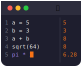

<div align="center">



# CrabCulator

[](https://www.rust-lang.org/)
[](https://github.com/marconae/crabculator/actions/workflows/ci.yml)
[](https://codecov.io/gh/marconae/crabculator)
[](LICENSE)

**A terminal-based calculator with a text-editor experience**

[Features](#features) • [Installation](#installation) • [Usage](#usage) • [Syntax](#expression-syntax) • [License](#license)
</div>

---

## Overview

Crabculator is a terminal-based calculator application that provides a text-editor-like experience for writing and
evaluating math expressions. Write multiple lines of calculations, define variables, and see results update live as you
type.

## Features

- **TUI** — terminal-based user interface
- **Real-time evaluation** — Results update instantly as you type
- **Variable support** — Define variables (e.g., `a = 5 + 3`)
- **Math functions** — Built-in functions like `sqrt`, `sin`, `cos`, `tan`, `log`, `ln`, `abs`, `floor`, `ceil`
- **Constants** — Access `pi` and `e` directly in expressions
- **Inline error display** — Red underlined tokens with clear error explanations
- **Full editor navigation** — Cursor movement and editing anywhere in the document
- **Session persistence** — Variables persist across sessions

## Installation

### From source

Requires Rust 2024 edition.

```bash
git clone https://github.com/marconae/crabculator.git
cd crabculator
cargo install --path .
```

The binary will be available at `target/release/crabculator`.

## Usage

Launch the application:

```bash
crabculator
```

### Keyboard shortcuts

| Key                 | Action                 |
|---------------------|------------------------|
| `Arrow keys`        | Move cursor            |
| `Home` / `End`      | Jump to line start/end |
| `Ctrl+H`            | Toggle help overlay    |
| `Ctrl+R`            | Clear buffer           |
| `Ctrl+C` / `Ctrl+Q` | Exit                   |

## Expression Syntax

### Basic arithmetic

```
5 + 3          → 8
10 - 4         → 6
6 * 7          → 42
15 / 3         → 5
17 % 5         → 2
(5 + 3) * 2    → 16
```

### Variables

```
a = 5 + 3      → 8
b = a * 2      → 16
total = a + b  → 24
```

Variables persist across sessions and are stored in `~/.crabculator/state.json`.

### Built-in functions

| Category   | Function                             | Description                 |
|------------|--------------------------------------|-----------------------------|
| Basic      | `sqrt(x)`                            | Square root                 |
|            | `cbrt(x)`                            | Cube root                   |
|            | `abs(x)`                             | Absolute value              |
|            | `pow(base, exp)`                     | Power                       |
| Trig       | `sin(x)`, `cos(x)`, `tan(x)`         | Trigonometric (radians)     |
|            | `asin(x)`, `acos(x)`, `atan(x)`      | Inverse trigonometric       |
|            | `atan2(y, x)`                        | Two-argument arctangent     |
| Hyperbolic | `sinh(x)`, `cosh(x)`, `tanh(x)`      | Hyperbolic functions        |
|            | `asinh(x)`, `acosh(x)`, `atanh(x)`   | Inverse hyperbolic          |
| Log/Exp    | `ln(x)`                              | Natural logarithm           |
|            | `log(x)`, `log10(x)`                 | Base-10 logarithm           |
|            | `log2(x)`                            | Base-2 logarithm            |
|            | `exp(x)`                             | Exponential (e^x)           |
|            | `exp2(x)`                            | Power of 2 (2^x)            |
| Rounding   | `floor(x)`, `ceil(x)`                | Round down/up               |
|            | `round(x)`                           | Round to nearest            |
| Utility    | `min(a, b)`, `max(a, b)`             | Minimum/maximum             |
|            | `hypot(a, b)`                        | Hypotenuse (sqrt(a² + b²))  |

### Constants

| Constant | Value      |
|----------|------------|
| `pi`     | 3.14159... |
| `e`      | 2.71828... |

### Example session

```
radius = 5
area = pi * radius^2    → 78.5398...
circumference = 2 * pi * radius    → 31.4159...

a = 3
b = 4
hypotenuse = sqrt(a^2 + b^2)    → 5
```

## License

Free and open-source under [MIT](LICENSE).

---

Build with 🦀 Rust and made with ❤️ by [marconae – blogging on deliberate.codes](https://deliberate.codes). 
